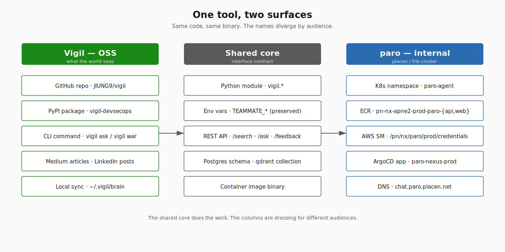
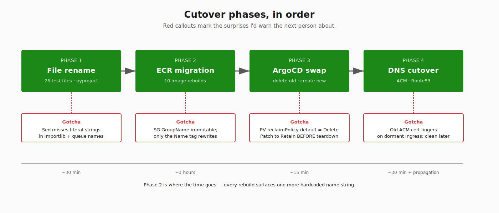
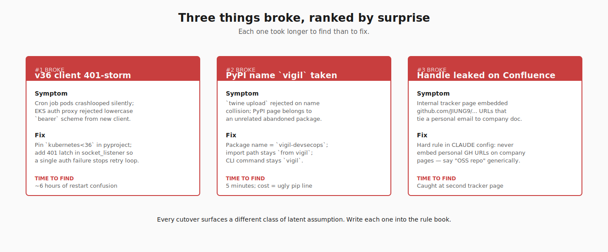

# One tool, two names: shipping a SRE assistant that is also open source

I built a tool called **paro** at work that pulls our SRE knowledge into a single search-and-chat surface — runbooks, past incidents, Slack threads, on-call paging history. It's been useful enough that I wanted to open-source the engine so other small DevSecOps teams could run it. The naming question turned out to be much harder than the engineering.

I'm going to walk through the dual-name decision — **Vigil** for the public OSS, **paro** for the internal deployment — and what the cutover looked like in practice. Both because someone else may face the same problem, and because I want to remember the gotchas next time I do this.

---

## The problem that started this

`teammate` was the name I shipped under for the first nine months. It made sense at the time: a co-pilot for the on-call engineer, sitting next to them in Slack. By the time I was preparing to push it out as open source, four things had broken about that name:

1. **It collides with everything.** Slack has a "Teammates" listing, Microsoft has a Teams app, GitHub's marketing copy uses "teammate" generically — none of it is searchable.
2. **It leaks identity.** Every Slack message starting "hey teammate, ..." became indistinguishable from human chatter. Logs were a nightmare to grep.
3. **It implies friendship, not vigilance.** What the tool actually does is watch — alarm streams, dashboards, log pipes — and surface the patterns a tired on-call engineer would miss. The name was selling the wrong promise.
4. **The internal references were going to leak.** Our K8s namespace was `teammate-agent`, our Postgres DB was `teammate_war`, our ECR repo was `pn-nx-apne2-prod-teammate-api`. Any of those names landing in an OSS GitHub repo would have given away the company-internal naming convention, which is something compliance generally prefers I don't do.

I needed a name that was clearly the tool's identity (not a generic noun), reflected what it does (watches), and let me keep internal infrastructure references out of public artifacts.



## Why two names instead of one

The cleanest move would have been to pick one name and use it everywhere. I almost did. Then I sat with three constraints:

- The internal name has to follow our company's existing convention: `pn-{group}-{service}-{region}-{env}-{type}`. That's not negotiable — it's how IAM policies, billing tags, and Terraform modules are organized. The OSS user community will never see this and shouldn't have to.
- The public name has to be Google-able, available on PyPI, and look reasonable on a CV. Internal naming conventions optimize for the opposite goal — uniqueness inside one company's account tree, not uniqueness on the open web.
- I want to keep the interface compatible. People running the OSS shouldn't have to relearn the API just because the rename happened. That meant preserving `TEAMMATE_*` environment variable names (interfaces don't rename in lockstep with packages without breaking everyone) even while the package and module names changed.

So: **Vigil** is what the world sees. **paro** is what runs in our cluster. They are the same code, the same binary, but the surfaces are named separately.

| Where | Name | Examples |
|---|---|---|
| GitHub repo, PyPI, Medium, LinkedIn | **Vigil** | `JIUNG9/vigil`, `pip install vigil-devsecops` |
| K8s namespace, ECR, AWS Secrets Manager, internal git | **paro** | `paro-agent`, `pn-nx-apne2-prod-paro-api`, `/pn/nx/paro/prod/credentials` |
| Env vars, internal Python module aliases | **teammate** (preserved) | `TEAMMATE_NAMESPACE`, `TEAMMATE_TOP_K` |
| Engineer's laptop sync dir | depends on context | `~/.vigil/brain` (OSS), `~/.paro/brain` (internal) |

The third row is the part most engineers will push back on. Why preserve `TEAMMATE_*` when the package renamed? Because env var names are an interface contract with everyone who has the previous package deployed. If I rename `TEAMMATE_NAMESPACE` to `VIGIL_NAMESPACE` or `PARO_NAMESPACE`, every existing deployment breaks at restart, silently, because Kubernetes doesn't validate env-var keys. The cost of one ugly residual name in the OSS code is much smaller than the cost of breaking real deployments.

---

## The cutover, sequenced

I want to be honest that this took longer than I budgeted. Here's the order, with what bit me at each step.

### Step 1 — File-level rename inside the OSS source

The easy part. `mv src/teammate src/vigil`, find/replace in 25 test files, update `pyproject.toml` package name, update README/CHANGELOG/all docs. One PR, mechanical.

The non-obvious gotcha: ruff's `isort` rules don't auto-update imports for you. A blanket sed of `from teammate.` → `from vigil.` worked for the easy cases but missed multi-line imports and `importlib.import_module("teammate.x")` strings. I caught those by running `python -m py_compile` on every module before pushing.

### Step 2 — Internal GitOps directory + Kubernetes resources

`platform/teammate/` → `platform/paro/`, 33 YAML files, lowercase-only substitution (preserving `TEAMMATE_*` env keys per the interface rule above). New ECR repos under `pn-nx-apne2-prod-paro-{api,web}` because ECR repo names are immutable.

The gotcha: AWS Security Group `GroupName` is immutable. I had `pn-nx-teammate-apne2-prod-alb-sg` created in an earlier session. I could update the Name tag freely, but the underlying GroupName is stuck. The only way to fully align is to create a new SG with the correct GroupName and migrate the ALB to it. I parked this — the SG is a tag mismatch, not a functional issue.

### Step 3 — Image rebuild + ECR migration

This is the step where surprises live. The package internals still import from `vigil.*`, but the deployed image had to be retagged and pushed to the new ECR repo. Ten rebuilds in one afternoon, each unmasking a different latent bug — wrong torch flavor pulling 5 GB of CUDA libs the cluster didn't need; the brain-repo writer trying to chmod files as non-root; a residual `socket_listener` calling `teammate-{routine}` queue names instead of `paro-{routine}`.

The lesson: cutovers expose every place where the name was hardcoded as a string instead of derived from a config var. I'd recommend a pre-cutover audit: grep for the old name in literal strings (not just imports) and refactor those to read from a single source of truth before you start renaming anything.



### Step 4 — ArgoCD app rename + ACM cert reissue

Old: `teammate-nexus-prod` Application pointing at `platform/teammate/`. New: `paro-nexus-prod` pointing at `platform/paro/`. The original ArgoCD app had to be deleted first — ArgoCD does not support in-place rename — and the path under it changed, so for a few minutes the old Application showed OutOfSync as it diff'd against a non-existent path.

ACM cert for `chat.teammate.placen.net` got left bound to a dormant Ingress through this transition (no DNS, no traffic — harmless but ugly). Six days later when v6 chat-web shipped I issued a fresh `chat.paro.placen.net` cert, swapped the Ingress, and deleted the old cert.

Route53: two new A-records, both ALB aliases. The catch: when I deleted the old Ingresses to free the ALBs, the records dangled briefly. I kept them in place rather than churning DNS, since users were already trained on the old URLs and getting "no answer" was less confusing than NXDOMAIN.

### Step 5 — PV reclaim policy + the quiet disaster averted

This was the only step where I burned a Slack thread to my future self about doing better. K8s default for dynamically-provisioned PVCs is `reclaimPolicy: Delete` — when the PVC goes away, so does the underlying EBS volume. **Before any namespace teardown, patch the PV reclaim to `Retain`.**

I caught this with five minutes to spare on the qdrant PVC, which had the only embedded copy of 15,000 corpus chunks. If I'd deleted the namespace before patching the PV, I'd have lost a week of indexer work. Now it's a hardcoded checklist item: **patch reclaim → verify reclaim → only then delete the namespace**.

---

## What broke after the cutover landed

Three things, ranked by how surprised I was.

1. **kubernetes-client v36 bearer-token bug.** The Python client started sending its bearer with a lowercase `bearer` scheme to EKS, and EKS's auth proxy returned 401. The cron jobs failed silently (the listener pod 401'd, then crashed, then restarted, then 401'd again). The fix was pinning `kubernetes<36` in `pyproject.toml` and adding a "401 latch" that disables K8s Job creation after the first auth failure rather than retrying in a tight loop.
2. **PyPI namespace conflict with `vigil`.** `vigil` itself was taken. I shipped as `vigil-devsecops`. The README and CLI command are still just `vigil` — the PyPI name is the most-quoted part of any pip install line, so I needed it distinct, but the import path and command name are what users type fifty times a day, so those needed to be short. (`pip install vigil-devsecops` → `from vigil import ...` is the same pattern Anthropic uses with `anthropic` package + `claude_anthropic` SDK on some platforms.)
3. **GitHub personal handle leaking onto company Confluence.** Once I had a public OSS repo, I caught myself embedding `github.com/JIUNG9/vigil` URLs in internal Confluence pages that referenced the project. That's a small leak — but my GitHub handle is tied to a personal email that doesn't belong on company-indexed surfaces. Fixed once, then I wrote a hard rule into my CLAUDE config: never embed personal GitHub URLs on company pages, always say "OSS repo" generically.



---

## What it actually costs

This is the table most cutover writeups skip. I'll be specific.

| Surface | Run rate |
|---|---|
| Vigil OSS (GitHub repo, PyPI publish, GitHub Actions CI) | **$0/month** |
| paro internal — running fully (cluster pods + 2 ALBs + WAF + 1 extra system node) | ~$200/month |
| paro internal — idled (only PVCs + WAF + SM + ECR + Route53) | ~$11/month |

The most useful split is: **the OSS track was always going to be free.** GitHub Actions covers CI for public repos at no cost; PyPI is free; GitHub Pages is free. Anything I learn from open-sourcing this is recovered without burning a budget.

The internal track is where money lives. Even fully idled — every pod stopped, ArgoCD app deleted, ALBs torn down — I'm still paying $11/month for the durable data (PVCs holding 15k corpus chunks, the AWS Secrets Manager entry, the orphan WAF). When pods are running, the system-nodegroup bump alone adds $77/month for one t3.large.

This means I can keep paro alive in idle mode indefinitely and decide later when to turn it back on, without the cost of restart being any meaningful blocker. The Terraform for the WAF, SQS, ACM cert, Route53 records is all still in place; an `argocd app create paro-nexus-prod` plus a nodegroup scale-up brings the whole system back in fifteen minutes.

---

## What I'd do differently

A few things, mostly procedural.

- **Audit hardcoded name strings first.** Before renaming anything, grep the codebase for the old name as a literal string (not just an import). I burned an afternoon of rebuilds on SQS queue names hardcoded in two different places.
- **Decide PV reclaim policy at PVC creation, not at teardown.** All durable PVCs should be created with `reclaimPolicy: Retain` from day one. Patching at teardown time is a footgun.
- **Pin major versions of fragile client libraries.** `kubernetes<36` should have been there from the start. The next breaking change is just one minor version away.
- **Pick the OSS name before the internal name, not the other way around.** The constraint that gets dropped most cheaply is the company convention — names can always be aliased. The OSS name has to clear PyPI, Google search, and a domain check, and those are harder.
- **Write the dual-name rule down in CLAUDE config the moment you make the decision.** Six weeks later when an AI assistant or a future-you is composing an internal Confluence page, the rule is what keeps the personal handle from leaking.

---

## Try it yourself

The OSS install is one line:

```
pip install vigil-devsecops
vigil setup
```

`vigil setup` walks you through pointing it at your team's Slack workspace, git repos, and on-call schedule. The brain auto-builds from documents you already have — markdown runbooks, past Slack threads, resolved Jira incidents. You can run it entirely on your laptop (`~/.vigil/brain`) before you decide whether it's worth the cluster footprint.

If you want to run the full internal pattern — Postgres + Qdrant + reranker + war-room SSE — the manifests under [`platform/paro/` in the gitops repo template](https://github.com/JIUNG9/vigil/tree/main/examples/k8s) are a starting point. The README in that directory documents the AWS resources you'll need to mirror.

The biggest single piece of advice if you're considering this: **the value isn't in the system running, it's in the human loop.** Build it to be turned off cheaply. The minute you can't afford to idle, you've over-built.
