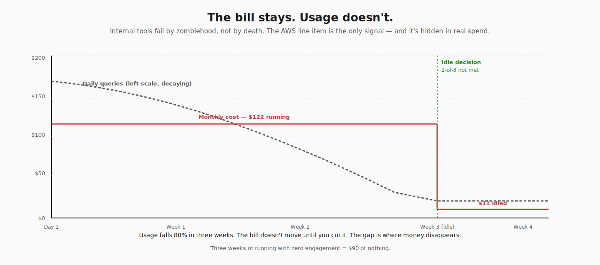
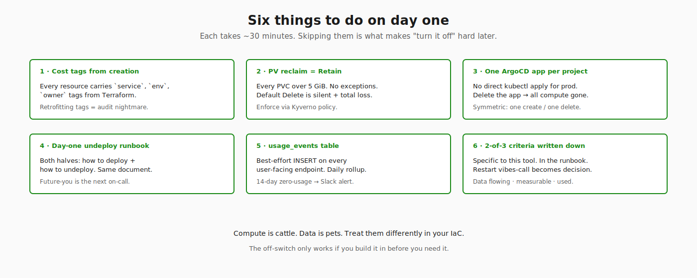

# Build it to be turned off cheaply

A week after shipping v6 of my internal SRE assistant, I turned it off.

Not because it broke. Not because the team rejected it. The system worked — embeddings flowed, alerts ingested, search returned reasonable hits. I turned it off because I couldn't make a clean argument for keeping it running, and the bill was about to roll over into a second month of charges I wasn't ready to defend.

The interesting part isn't the decision. The interesting part is that turning it off took fifteen minutes and cost nothing irreversible. That isn't an accident. That's the part of the design I'd argue more about, if I were doing this again.

---

## The thing nobody tells you about internal tooling

When you build a tool for your own company, the framing you absorb from open source — "make it possible to install" — is the wrong frame. Internal tools don't have an install problem. They have an **idle problem**.

A SaaS startup measures success in monthly recurring users. Their incentive to keep the service warm is the bill they send. An internal tool has no such forcing function. If the on-call engineer doesn't reach for it, it costs money silently and produces nothing.

The default failure mode of internal tools is not death. It's **zombiehood** — a fleet of services consuming CPU, memory, and storage on behalf of features nobody is using. The only signal is the AWS bill, and the AWS bill is full of services people are using, so the zombie hides in the noise.

The design instinct that saved me was treating "off" as a first-class state, not a failure mode.

---

## The $200/month freezer

When paro was running, my AWS account was paying about $200/month for it. Most of that wasn't the application — it was the **shape of running**: one extra node in the system nodegroup to schedule the qdrant pod ($77), two ALBs to terminate TLS at the edge ($34), a WAF Web ACL for the webhook ingress ($7), the rest in PVCs and small services.

When I turned it off, the bill dropped to about $11/month. The data — qdrant's 15,000+ embedded chunks, the Postgres schema, the bm25 index — all stayed on three EBS volumes. Restartable at any time. Just nothing running on top.

Eleven dollars a month is roughly the cost of three cups of coffee. That's what it costs me to keep the option open to bring paro back without losing a week of indexer work. I'd pay that even if I never restarted.

The $122 to $11 delta isn't the lesson, though. **Fifteen minutes** is the lesson. That's how long the off-switch took. Three commands: delete two Ingresses, scale a nodegroup, delete some orphans. The Terraform stays. The container images stay. The secrets stay. Everything that took weeks to build stays exactly where it is.

If the off-switch had taken hours, or required a runbook nobody had written, or involved any data migration — I'd have just left it running. Most teams do, which is why the AWS quarterly review is always a mass extinction event for forgotten services.

---

## What I did right, mostly by accident

A few decisions paid off. None of them felt important at the time.

**Persistent data on EBS, not in pod-local storage.** Qdrant runs from a 20 GiB PVC. Postgres runs from a 10 GiB PVC. Both are bound, both can survive a namespace delete if — and this is the important if — the PV reclaim policy is set to `Retain`. The default in Kubernetes is `Delete`. I caught this five minutes before tearing down the test environment for the first time. I'd recommend writing a Kyverno policy that requires `Retain` on any PVC larger than 5 GiB. The PV-deletes-volume default exists for legitimate reasons but the failure mode is silent and total.

**ArgoCD as the only way to deploy.** Every Kubernetes resource in paro came from a YAML file in a git repo, applied by ArgoCD. When I deleted the ArgoCD Application, all 11 Deployments, 4 CronJobs, 2 Services, and 5 ConfigMaps went with it. One delete, the whole compute layer goes. If I'd been applying YAMLs directly with `kubectl apply`, the teardown would have been a 30-command scavenger hunt.

**Terraform creates resources, not data.** The Terraform repo defines the SQS queue, the ACM cert, the WAF, the Route53 records, the IAM role. None of it stores the actual data. Destroying it deletes resources; running `terraform apply` again recreates them in 3 minutes. The data lives in PVCs and AWS Secrets Manager, which are managed separately and have different lifecycle rules. **Compute is cattle. Data is pets.** Treating them differently in your IaC is the difference between a 15-minute restart and a "let me check if the backup is recent" panic.

**Image tags don't get garbage-collected aggressively.** I kept `:v6.0` and `:latest` in ECR with a lifecycle policy that retains the last 30 tags. Cost: about $0.50/month. Value: I can scroll back through six months of releases. Don't be aggressive about ECR cleanup. Storage is the cheapest thing in AWS; rebuilds when you need a specific old tag are the most expensive thing you do.

---

## What I'd actually do differently

Three things, all small, all the kind of thing you only catch the second time.

**Write the off-switch into the runbook on day one.** I wrote the cutover runbook in February when I first deployed. It explained how to deploy. It did not explain how to undeploy. When I idled the service in May, I had to figure out the exact command sequence from scratch — what to delete, in what order, what stays. I wrote that down after, and the next person (probably future-me) gets to use it. Day-one runbooks should always have a symmetric "rollback" or "undeploy" section. Both halves are runbook content, not bonus material.

**Set up the cost dashboard before the launch, not after.** I knew paro was costing ~$120/month because I went looking. The CloudWatch billing dashboard would have shown me that without any effort, if I'd configured it. Now I have an explicit "service-level cost" view per project — partitioned by tag — and I check it weekly. The $77 nodegroup line item would have caught my eye a week earlier if the dashboard had existed.

**Treat the "is it being used?" signal as a first-class metric.** I had no instrumentation for whether anyone was actually reaching for the search endpoint. I had to ask. The right pattern is a simple `usage_events` table — incrementing counters keyed by user and endpoint, written best-effort — with a daily rollup. Usage being zero or near-zero should be a Slack alert, not something you have to remember to query. If a service hasn't been used in 14 days, the question "should this be on?" should answer itself.

---

## The 2-of-3 test

When I documented the idle decision in the runbook, I wrote down three criteria. Restart paro when **two of three** are true:

1. **Webhooks wired.** The continuous-learning loop has to actually close. Without GitHub + SigNoz at minimum pushing events into the system, the qdrant index freezes at whatever date it last ingested. A frozen brain decays fast: every passing day, the documentation it knows is more out of date.
2. **Golden test set labeled.** Not 15 self-baselined pairs against the system's own current top-1 picks. 50+ human-judged QA pairs from real resolved incidents, with the gold doc-id confirmed by a person. Without this, "is v6 better than v1?" can't be measured, which means "should we be running v6?" is a vibes call.
3. **Daily-use commitment.** Someone has to actually open the thing first when an alert fires. Not be reminded to. Not be marketed at. Default to it. If kubectl + SigNoz is still the first move, the tool is a freezer — running, costing money, doing nothing.

The pattern generalizes. Any internal tool you've built can be asked the same three questions: is fresh data flowing into it, can you measure whether it's good, is anyone reaching for it. If two of three are no, the right move is almost always to turn it off.

The third criterion is the soft one. People say they'll use a tool and then don't. The right way to test it isn't to ask — it's to turn the tool off and see who notices.

---

## The math, again

| State | $/month | What's running |
|---|---|---|
| Fully running | ~$200 | 11 pods + 2 ALBs + WAF + extra nodegroup node |
| Idled (current) | ~$11 | 3 PVCs + AWS SM + ECR + WAF orphan |
| Fully torn down | ~$4 | Just PVCs + ECR + SM |

The cheapest state isn't zero. The cheapest **safe** state is $4/month — just the durable data and the secrets, no compute. That's roughly 2% of the running cost. Within an order of magnitude of free.

Internal tooling that can sit at 2% of its running cost between bursts of use is in a fundamentally different category from a SaaS service you have to keep warm. It's closer to a Lambda function with persistent state than a microservice. That mental shift — from "always-on" to "warm when needed" — is what makes building this stuff sustainable on a one-person budget.

---

## The thing this changed about how I build

I'm in the middle of a different project now. The thing I'm doing differently from the start:

- Cost-tag every resource at creation, not retrofitted later
- Reclaim policy `Retain` on every PVC over 5 GiB, no exceptions
- One ArgoCD app per project, no direct `kubectl apply`
- Day-one runbook with both a "deploy" and an "undeploy" section
- A `usage_events` table behind every user-facing endpoint, written best-effort
- A 2-of-3 question I'd write on day one for that specific tool

None of this is sophisticated. It's the kind of stuff that takes thirty minutes to set up at the start and saves you a panicked Friday afternoon six months in.

The bias I'd push back on hardest is the one that says you should treat your own infrastructure with the same gravity as a customer-facing service. **Customer-facing services have customers.** Internal tools have you. You're allowed to turn them off. The whole architecture should make that possible without losing the work.

---

*This is part 9 of the Building Vigil series. Part 8 — [One tool, two names](08-rename-and-cutover.md) — covers the OSS/internal naming decision. The Vigil OSS at `pip install vigil-devsecops` is the externalized version of the engine; the internal one lives as `paro` and, as of this writing, is idled.*
